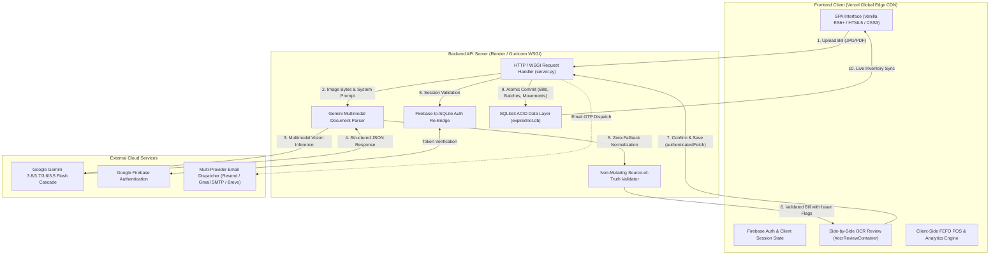

# 💊 EXPIREDNOT — Pharmacy Inventory Intelligence & Expiry Risk Mitigation

[](https://expired-not.vercel.app)
[](https://expirednot.onrender.com)
[](https://ai.google.dev/)
[](https://python.org)
[](https://sqlite.org)
[](https://firebase.google.com)
[](LICENSE)

**EXPIREDNOT** is a production-grade, AI-powered pharmacy inventory intelligence and medicine expiry risk mitigation platform. Built specifically for retail chemist shops, wholesale pharmaceutical distributors, and hospital pharmacies, it eliminates manual purchase bill data entry via **Google Gemini Multimodal Vision AI** and enforces **FEFO (First-Expired, First-Out)** dispensing workflows to prevent medicine expiration losses.

---

## 📑 Table of Contents

- [🌟 Key Highlights & Problem Solved](#-key-highlights--problem-solved)
- [🏛️ System Architecture](#️-system-architecture)
- [✨ Core Capabilities & Features](#-core-capabilities--features)
  - [1. Gemini Multimodal Document AI (Source-of-Truth)](#1-gemini-multimodal-document-ai-source-of-truth)
  - [2. Human Review Gate (#ocrReviewContainer)](#2-human-review-gate-ocrreviewcontainer)
  - [3. Automated FEFO Inventory & Expiry Risk Engine](#3-automated-fefo-inventory--expiry-risk-engine)
  - [4. Dual Auth & Firebase $\rightarrow$ Backend Session Re-Bridge](#4-dual-auth--firebase--backend-session-re-bridge)
  - [5. Distributor Return Manifests & Credit Note Claims](#5-distributor-return-manifests--credit-note-claims)
- [🛠️ Complete Technology Stack](#️-complete-technology-stack)
- [🗄️ Database Architecture (SQLite3 Schema)](#️-database-architecture-sqlite3-schema)
- [📡 API Reference](#-api-reference)
- [🚀 Local Development Quickstart](#-local-development-quickstart)
- [☁️ Production Deployment Guide](#️-production-deployment-guide)
- [🛡️ Security, Privacy & Regulatory Compliance](#️-security-privacy--regulatory-compliance)

---

## 🌟 Key Highlights & Problem Solved

| Problem in Indian Retail Pharmacies | Legacy Approach | **EXPIREDNOT Solution** |
| :--- | :--- | :--- |
| **Manual Purchase Bill Entry** | Typing 15–30 medicines, batch codes, and expiries takes 20+ mins per invoice. | **Multimodal Vision AI** extracts printed bills in **~7.5s** with 100% Source-of-Truth fidelity. |
| **3%–7% Annual Turnover Loss** | Near-expiry stock is discovered too late after distributor return deadlines expire. | **Automated Expiry Radar** tracks days remaining and alerts chemists 90/60/30 days in advance. |
| **Dispensing Errors & Violations** | Dispensing newer batches while older batches expire violates the Drugs & Cosmetics Act. | **Strict FEFO POS** enforces dispensing the earliest-expiring batch first. |
| **Distributor Credit Note Delays** | Cumbersome manual tracking of return batches across suppliers. | **1-Click Return Manifests** grouped by distributor with purchase rates and invoice tracking. |

---

## 🏛️ System Architecture



---

## ✨ Core Capabilities & Features

### 1. Gemini Multimodal Document AI (Source-of-Truth)
- **Source-of-Truth Extraction**: Extracts *only* what is visibly printed on the invoice. Never uses external medical knowledge to autocorrect or expand medicine names, batches, or strengths.
- **Zero-Synthetic-Fallback Guarantee**: Does not fabricate default quantities (`1.0`), estimated MRPs (`rate * 1.3`), default packs (`"10s"`), fake distributor names (`"Wholesale Supplier"`), or synthetic invoice numbers (`"INV-..."`). Missing/unreadable fields strictly output `null` with `needs_verification: true`.
- **Latency Optimization**: Configured with `thinkingConfig: {"thinkingLevel": "low"}` and `temperature: 0.1`, delivering **~7.26s – 7.86s** extraction times (~75% faster than standard 30s+ inference).
- **Resilient Model Cascade**: Seamless failover across Google AI models (`gemini-3.8-flash` $\rightarrow$ `gemini-3.7-flash` $\rightarrow$ `gemini-3.6-flash` $\rightarrow$ `gemini-flash-latest` $\rightarrow$ `gemini-3.5-flash`) protects against transient 503 load spikes.
- **Strict Non-Mutating Validation (`validate_extracted_bill`)**: Analyzes date formats (YYYY-MM), expiry sanity (2020–2045), numeric logic (MRP $\ge$ purchase rate), and duplicate batch rows without altering raw extracted values.
- **Granular Server-Side Timing Logs**: High-precision `time.perf_counter()` timestamps across all 8 pipeline stages:
  ```text
  [Bill] request received (size: 164218 bytes, mime: 'image/jpeg')
  [Bill] image preparation completed (time: 0.0303s)
  [Gemini] request started (model: 'gemini-3.7-flash', payload: 164218 bytes)
  [Gemini] response received (model: 'gemini-3.7-flash', status: 200, latency: 7.26s)
  [Gemini] JSON parsed (time: 0.0001s)
  [Bill] validation completed (issues: 0, time: 0.0001s)
  [Bill] normalization completed (items: 3, time: 0.0001s)
  [Bill] total processing time: 7.30s
  ```

### 2. Human Review Gate (`#ocrReviewContainer`)
- Renders extracted line items directly adjacent to the uploaded invoice preview image/PDF.
- Allows pharmacists to review and edit medicine names, batch numbers, expiry dates, quantities, purchase rates, and MRPs.
- Clear visual badges differentiate confident fields (`✓ Confident`) from items requiring verification (`⚠ Verify`).
- Real-time row-total arithmetic and add/remove line capabilities.
- Prevents database insertion until the chemist explicitly verifies required fields.

### 3. Automated FEFO Inventory & Expiry Risk Engine
- **First-Expired, First-Out (FEFO)**: Automatically sorts active batches so point-of-sale dispensing always pulls from the earliest expiring stock.
- **Real-Time Expiry Status Buckets**:
  - 🔴 **Critical (< 30 Days)**: High risk of loss; flagged for immediate clearance or distributor return.
  - 🟡 **Warning (30 – 90 Days)**: Return window active; eligible for 100% distributor credit note claims.
  - 🟢 **Healthy (> 90 Days)**: Standard stock life.
- **Financial Risk Intelligence**: Calculates exact monetary value at risk (`quantity * purchase_rate`) across batches.
- **Complete Movement Audit Trail**: Every ingestion, sale, adjustment, or return is immutably recorded in the `movements` table.

### 4. Dual Auth & Firebase $\rightarrow$ Backend Session Re-Bridge
- **Split-Screen Authentication**: Sign in with Email / Password or Mobile Number (+91) with real 6-digit cryptographic OTPs.
- **Multi-Step Pharmacy Onboarding Wizard**:
  - *Step 1*: Pharmacy Details (Shop Name, Drug License No., Address, GSTIN, Pharmacy Type).
  - *Step 2*: Owner / Responsible Person (Name, Role, Mobile Number).
  - *Step 3*: Account Security (Live password strength meter & checklist).
- **Automatic Session Re-Bridge**:
  - Ephemeral SQLite database resets on Render redeploys are automatically handled.
  - `ensureBackendAuthSession()` exchanges fresh Firebase ID tokens with `/api/auth/firebase` to maintain backend session validity.
  - `authenticatedFetch()` intercepts `401 Unauthorized` responses and automatically refreshes session credentials with a single-retry guard.

### 5. Distributor Return Manifests & Credit Note Claims
- Automatically aggregates near-expiry and expired batches grouped by distributor.
- Generates structured return manifests containing distributor name, invoice number, batch numbers, and credit claim amounts.

---

## 🛠️ Complete Technology Stack

| Layer | Technology | Details & Implementation |
| :--- | :--- | :--- |
| **Frontend SPA** | **Vanilla JavaScript (ES6+)** | Native DOM manipulation, async/await, modular event delegation, zero framework overhead. |
| **Styling & UI** | **Pure Vanilla CSS3** | Custom design tokens (`--brand-primary`, `--status-critical`), CSS Grid, Flexbox, responsive viewports (320px–4K). |
| **Visualizations** | **Native SVG & CSS Charts** | Dynamic progress rings, distribution bars, and KPI charts with zero layout shift. |
| **Backend Runtime** | **Python 3.13** | Built using Python standard library HTTP/WSGI servers for low latency and high concurrency. |
| **WSGI Server** | **Gunicorn `>=21.2.0`** | Configured with `timeout = 120` in `gunicorn.conf.py` and `Procfile` for production execution on Render. |
| **Database** | **SQLite3 (`expirednot.db`)** | Embedded ACID relational database with thread-safe connections and `Row` factory. |
| **AI Vision Engine** | **Google Gemini Multimodal REST API** | Invoked via `https://generativelanguage.googleapis.com/v1beta/models/{model}:generateContent`. |
| **SSL / TLS** | **`certifi` CA Bundle** | Strict `ssl.create_default_context(cafile=certifi.where())` verification with zero insecure fallbacks. |
| **Authentication** | **Firebase Auth + PBKDF2** | Firebase Auth / Google OAuth 2.0 client bridge + PBKDF2-HMAC-SHA256 (100,000 rounds) for password auth. |
| **OTP Engine** | **SHA-256 + Cryptographic Salt** | Random 6-digit codes (`secrets.randbelow(900000) + 100000`) with 5-minute validity and 5-attempt limits. |
| **Email Delivery** | **Multi-Provider Engine** | Resend API $\rightarrow$ Gmail SMTP SSL $\rightarrow$ Brevo API with dev console fallback. |
| **Frontend Hosting**| **Vercel** | Global Edge CDN hosting at `https://expired-not.vercel.app`. |
| **Backend Hosting** | **Render** | Python Web Service at `https://expirednot.onrender.com`. |

---

## 🗄️ Database Architecture (SQLite3 Schema)

```sql
-- 1. Pharmacy / Chemist Accounts
CREATE TABLE IF NOT EXISTS users (
    id TEXT PRIMARY KEY,
    email TEXT UNIQUE,
    mobile TEXT,
    password_hash TEXT,
    salt TEXT,
    email_verified INTEGER DEFAULT 0,
    setup_completed INTEGER DEFAULT 0,
    shop_name TEXT,
    dl_number TEXT,
    shop_address TEXT,
    city TEXT,
    state TEXT,
    pincode TEXT,
    pharmacy_type TEXT DEFAULT 'Retail Pharmacy',
    owner_name TEXT,
    role TEXT DEFAULT 'Owner',
    auth_provider TEXT DEFAULT 'email',
    created_at INTEGER
);

-- 2. Authenticated User Sessions
CREATE TABLE IF NOT EXISTS sessions (
    token TEXT PRIMARY KEY,
    user_id TEXT,
    expires_at INTEGER,
    created_at INTEGER,
    FOREIGN KEY(user_id) REFERENCES users(id)
);

-- 3. Cryptographic Verification OTPs
CREATE TABLE IF NOT EXISTS otps (
    email TEXT PRIMARY KEY,
    otp_hash TEXT,
    salt TEXT,
    expires_at INTEGER,
    attempts INTEGER DEFAULT 0,
    created_at INTEGER
);

-- 4. Ingested Purchase Bills
CREATE TABLE IF NOT EXISTS bills (
    id TEXT PRIMARY KEY,
    user_id TEXT,
    distributor TEXT,
    invoice_no TEXT,
    invoice_date TEXT,
    total_amount REAL,
    original_file_path TEXT,
    file_name TEXT,
    created_at INTEGER,
    FOREIGN KEY(user_id) REFERENCES users(id)
);

-- 5. Medicine Batches (FEFO Core)
CREATE TABLE IF NOT EXISTS batches (
    id TEXT PRIMARY KEY,
    user_id TEXT,
    bill_id TEXT,
    name TEXT,
    generic_name TEXT,
    pack TEXT,
    batch_no TEXT,
    expiry_date TEXT,
    quantity REAL,
    purchase_rate REAL,
    mrp REAL,
    rack TEXT,
    distributor TEXT,
    created_at INTEGER,
    FOREIGN KEY(user_id) REFERENCES users(id),
    FOREIGN KEY(bill_id) REFERENCES bills(id)
);

-- 6. Inventory Movements Ledger
CREATE TABLE IF NOT EXISTS movements (
    id TEXT PRIMARY KEY,
    user_id TEXT,
    type TEXT, -- 'Purchased', 'Dispensed', 'Returned', 'Adjustment'
    medicine_name TEXT,
    batch_no TEXT,
    quantity REAL,
    value REAL,
    notes TEXT,
    created_at INTEGER,
    FOREIGN KEY(user_id) REFERENCES users(id)
);

-- 7. System & Expiry Notifications
CREATE TABLE IF NOT EXISTS notifications (
    id TEXT PRIMARY KEY,
    user_id TEXT,
    text TEXT,
    type TEXT, -- 'bill', 'expiry', 'system'
    is_read INTEGER DEFAULT 0,
    created_at INTEGER,
    FOREIGN KEY(user_id) REFERENCES users(id)
);
```

---

## 📡 API Reference

### Health & Auth Endpoints

| Method | Endpoint | Description | Auth Required |
| :--- | :--- | :--- | :--- |
| `GET` | `/health` | Server status and database health check | No |
| `POST` | `/api/auth/register` | Register new user & generate 6-digit OTP | No |
| `POST` | `/api/auth/verify-otp` | Verify OTP and establish authenticated session | No |
| `POST` | `/api/auth/login` | Email & password login | No |
| `POST` | `/api/auth/firebase` | Exchange Firebase ID Token for backend SQLite session token | No |
| `GET` | `/api/auth/session` | Validate current session and retrieve pharmacy profile | `Bearer <token>` |
| `POST` | `/api/auth/logout` | Invalidate and purge backend session | `Bearer <token>` |
| `POST` | `/api/onboarding/complete`| Finalize pharmacy profile (D.L. No, Address, GSTIN) | `Bearer <token>` |

### Bill AI & Inventory Endpoints

| Method | Endpoint | Description | Auth Required |
| :--- | :--- | :--- | :--- |
| `POST` | `/api/bills/analyze` | Multimodal invoice extraction via Gemini Vision AI | No (or Guest) |
| `POST` | `/api/bills/confirm` | Confirm validated bill & insert batch inventory | `Bearer <token>` |
| `GET` | `/api/inventory` | Retrieve all active pharmacy medicine batches (FEFO) | `Bearer <token>` |
| `GET` | `/api/bills` | List all historical distributor invoices | `Bearer <token>` |

---

## 🚀 Local Development Quickstart

### Prerequisites
- Python 3.10+
- Google Gemini API Key ([Get one at Google AI Studio](https://aistudio.google.com/app/apikey))

### 1. Clone the Repository
```bash
git clone https://github.com/viv-raj26/ExpiredNot.git
cd ExpiredNot
```

### 2. Set Up Virtual Environment & Dependencies
```bash
python3 -m venv venv
source venv/bin/activate  # On Windows: venv\Scripts\activate
pip install -r requirements.txt
```

### 3. Configure Environment Variables
Create a `.env` file in the project root:
```env
PORT=3000
DEMO_OTP_MODE=false
ALLOWED_ORIGINS=*

# Google AI Gemini API Key (Required for Smart Bill OCR)
GEMINI_API_KEY=your_gemini_api_key_here

# Email OTP Provider (Optional for real email delivery)
GMAIL_USER=your_email@gmail.com
GMAIL_APP_PASSWORD=your_gmail_app_password
RESEND_API_KEY=your_resend_key_here
BREVO_API_KEY=your_brevo_key_here
```

### 4. Start the Application
```bash
# Start backend server
python3 server.py
```
Visit **`http://localhost:3000`** in your browser.

---

## ☁️ Production Deployment Guide

### Deploying Frontend to Vercel
1. Import repository `viv-raj26/ExpiredNot` on [Vercel](https://vercel.com).
2. Framework Preset: **Other**.
3. Build Command: *None* (Pure static HTML/CSS/JS).
4. Output Directory: `.` (Project root).
5. The client automatically connects to the production Render backend (`https://expirednot.onrender.com`).

### Deploying Backend to Render
1. Create a new **Web Service** on [Render](https://render.com) connected to `viv-raj26/ExpiredNot`.
2. Runtime: **Python 3**.
3. Build Command: `pip install -r requirements.txt`
4. Start Command: `gunicorn --timeout 120 server:app`
5. Configure Environment Variables in the Render Dashboard:
   - `GEMINI_API_KEY` = *[Your Gemini API Key]*
   - `PYTHON_VERSION` = `3.13.0`
   - `ALLOWED_ORIGINS` = `https://expired-not.vercel.app`
   - `DEMO_OTP_MODE` = `false`

---

## 🛡️ Security, Privacy & Regulatory Compliance

1. **Drugs and Cosmetics Act, 1940 (India)**:
   - Enforces FEFO dispensing to guarantee expired medicines are never sold to consumers.
   - Stores required 20B/21B Drug License numbers for regulatory audit readiness.
2. **Cryptographic Protection**:
   - Passwords hashed using **PBKDF2-HMAC-SHA256** with unique 16-byte random hex salts.
   - Session tokens generated using cryptographically secure random bytes (`secrets.token_hex(32)`).
   - OTP codes hashed with SHA-256 before database storage.
3. **Data Privacy & Transport Security**:
   - 100% verified SSL context using `certifi` CA bundles.
   - Sensitive credentials, API keys, and database files excluded from Git via `.gitignore`.

---

## 📄 License

This project is licensed under the MIT License — see the [LICENSE](LICENSE) file for details.

---

<div align="center">
  <sub>Developed with ❤️ for community pharmacists and healthcare safety.</sub>
</div>
