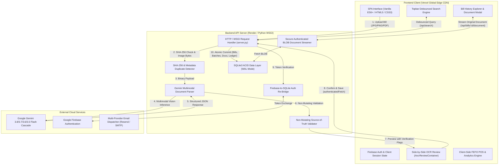

# 💊 EXPIREDNOT — Pharmacy Inventory Intelligence & Expiry Risk Mitigation

[](https://expirednot.vercel.app)
[](https://expirednot.onrender.com)
[](https://ai.google.dev/)
[](https://python.org)
[](https://sqlite.org)
[](https://firebase.google.com)
[](LICENSE)

**EXPIREDNOT** is a production-grade, AI-powered pharmacy inventory intelligence and medicine expiry risk mitigation platform. Built specifically for retail chemist shops, wholesale pharmaceutical distributors, and hospital pharmacies, it eliminates manual purchase bill data entry via **Google Gemini Multimodal Vision AI** and enforces **FEFO (First-Expired, First-Out)** dispensing workflows to prevent medicine expiration losses.

---

## 📑 Table of Contents

- [🌟 Key Highlights & Problem Solved](#-key-highlights--problem-solved)
- [🏛️ System Architecture](#️-system-architecture)
- [✨ Core Capabilities & Features](#-core-capabilities--features)
  - [1. Gemini Multimodal Document AI (Source-of-Truth)](#1-gemini-multimodal-document-ai-source-of-truth)
  - [2. Human Review Gate (#ocrReviewContainer)](#2-human-review-gate-ocrreviewcontainer)
  - [3. Permanent Bill History & BLOB Document Storage](#3-permanent-bill-history--blob-document-storage)
  - [4. Global Real-Time Search Engine](#4-global-real-time-search-engine)
  - [5. Intelligent Duplicate Bill Detection (2-Level)](#5-intelligent-duplicate-bill-detection-2-level)
  - [6. Automated FEFO Inventory & Expiry Risk Engine](#6-automated-fefo-inventory--expiry-risk-engine)
  - [7. Pharmacy Profile & Centralized Session Management](#7-pharmacy-profile--centralized-session-management)
  - [8. Dual Auth & Firebase $\rightarrow$ Backend Session Re-Bridge](#8-dual-auth--firebase--backend-session-re-bridge)
- [🛠️ Complete Technology Stack](#️-complete-technology-stack)
- [🗄️ Database Architecture (SQLite3 Schema)](#️-database-architecture-sqlite3-schema)
- [📡 API Reference](#-api-reference)
- [🚀 Local Development Quickstart](#-local-development-quickstart)
- [☁️ Production Deployment Guide](#️-production-deployment-guide)
- [🛡️ Security, Privacy & Regulatory Compliance](#️-security-privacy--regulatory-compliance)

---

## 🌟 Key Highlights & Problem Solved

| Problem in Indian Retail Pharmacies | Legacy Approach | **EXPIREDNOT Solution** |
| :--- | :--- | :--- |
| **Manual Purchase Bill Entry** | Typing 15–30 medicines, batch codes, and expiries takes 20+ mins per invoice. | **Multimodal Vision AI** extracts printed bills in **~7.5s** with 100% Source-of-Truth fidelity. |
| **3%–7% Annual Turnover Loss** | Near-expiry stock is discovered too late after distributor return deadlines expire. | **Automated Expiry Radar** tracks days remaining and alerts chemists 90/60/30 days in advance. |
| **Dispensing Errors & Violations** | Dispensing newer batches while older batches expire violates the Drugs & Cosmetics Act. | **Strict FEFO POS** enforces dispensing the earliest-expiring batch first. |
| **Duplicate Bill Entries** | Accidental re-scanning of the same invoice inflates inventory counts and causes tax mismatches. | **2-Level Duplicate Guard** (SHA-256 file checksum + metadata matching) prevents double-entry. |
| **Lost Physical Invoices** | Paper bills degrade or get lost, making tax audits and distributor credit claims impossible. | **Permanent SQLite BLOB Storage** preserves the original image/PDF alongside the digital ledger. |

---

## 🏛️ System Architecture



---

## ✨ Core Capabilities & Features

### 1. Gemini Multimodal Document AI (Source-of-Truth)
- **Source-of-Truth Extraction**: Extracts *only* what is visibly printed on the invoice. Never uses external medical knowledge to autocorrect or expand medicine names, batches, or strengths.
- **Zero-Synthetic-Fallback Guarantee**: Does not fabricate default quantities (`1.0`), estimated MRPs (`rate * 1.3`), default packs (`"10s"`), fake distributor names (`"Wholesale Supplier"`), or synthetic invoice numbers (`"INV-..."`). Missing/unreadable fields strictly output `null` with `needs_verification: true`.
- **Latency Optimization**: Configured with `thinkingConfig: {"thinkingLevel": "low"}` and `temperature: 0.1`, delivering **~7.2s – 7.8s** extraction times.
- **Resilient Model Cascade**: Seamless failover across Google AI models (`gemini-3.8-flash` $\rightarrow$ `gemini-3.7-flash` $\rightarrow$ `gemini-3.6-flash` $\rightarrow$ `gemini-flash-latest` $\rightarrow$ `gemini-3.5-flash`) protects against transient 503 load spikes.

### 2. Human Review Gate (`#ocrReviewContainer`)
- Renders extracted line items directly adjacent to the uploaded invoice preview image/PDF.
- Allows pharmacists to review and edit medicine names, batch numbers, expiry dates, quantities, purchase rates, and MRPs before saving.
- Clear visual badges differentiate confident fields (`✓ Confident`) from items requiring verification (`⚠ Verify`).

### 3. Permanent Bill History & BLOB Document Storage
- **Dedicated Section**: Permanent `🧾 Bill History` tab in the vertical sidebar.
- **Multi-Field Search & Filter**: Search across distributor, invoice number, medicine name, batch number, place/city, GSTIN, or DL number with date range (*Today*, *Last 7 Days*, *Last 30 Days*, *All Time*) and price sorting.
- **Permanent SQLite BLOB Storage**: Uploaded bills (images and PDFs) are stored as binary objects (`BLOB`) in the `bill_documents` table, surviving server restarts and redeployments.
- **Authenticated Streaming (`/api/bills/:id/document`)**: Securely streams the original invoice with session token authorization and cross-user data isolation.

### 4. Global Real-Time Search Engine
- Topbar search input (`#globalMedicineSearchInput`) with 150ms client debouncing.
- Searches both **Medicines & Batches** (with live FEFO status tags: *Safe*, *Near Expiry*, *Expired*, and available stock) and **Purchase Bills** (with supplier, invoice #, and amount).
- **Instant Click Navigation**: Clicking a medicine navigates to the Inventory tab and applies the search filter; clicking a bill instantly opens the detailed Bill View modal.

### 5. Intelligent Duplicate Bill Detection (2-Level)
- **Level 1 (SHA-256 Exact File Hash)**: Before calling Gemini, checks if the exact file binary was previously uploaded by the user, immediately blocking redundant API calls and inventory duplication.
- **Level 2 (Supplier + Invoice Metadata Match)**: After extraction, detects if the same supplier and invoice number already exist, prompting the user with a warning modal offering *"View Existing Bill"*, *"Cancel Upload"*, or *"Continue Anyway"*.

### 6. Automated FEFO Inventory & Expiry Risk Engine
- **First-Expired, First-Out (FEFO)**: Automatically sorts active batches so point-of-sale dispensing always pulls from the earliest expiring stock.
- **Expiry Radar**:
  - 🔴 **Critical (< 30 Days)**: High risk of loss; flagged for immediate clearance or distributor return.
  - 🟡 **Warning (30 – 90 Days)**: Return window active; eligible for 100% distributor credit note claims.
  - 🟢 **Healthy (> 90 Days)**: Standard stock life.
- **Stock Clearance Ledger**: Track items sold, returned to distributor, or discarded with an immutable audit trail in `movements`.

### 7. Pharmacy Profile & Centralized Session Management
- Permanent storage of pharmacy credentials (Shop Name, Owner Name, DL No., GSTIN, Mobile, Address, Avatar) in the SQLite `users` table.
- Clean header interface: standalone logout button removed; **Sign Out** is cleanly housed inside the Pharmacy Profile modal (`#profileModal`).

### 8. Dual Auth & Firebase $\rightarrow$ Backend Session Re-Bridge
- Sign in with Email / Password, Mobile (+91) with cryptographic OTPs, or Google One-Tap / Firebase Auth.
- Session bridge automatically exchanges Firebase tokens with `/api/auth/firebase` to ensure seamless API access across page refreshes.

---

## 🛠️ Complete Technology Stack

| Layer | Technology | Details & Implementation |
| :--- | :--- | :--- |
| **Frontend SPA** | **Vanilla JavaScript (ES6+)** | Native DOM manipulation, async/await, modular event delegation, zero framework overhead. |
| **Styling & UI** | **Pure Vanilla CSS3** | Custom design tokens (`--brand-primary`, `--status-critical`), CSS Grid, Flexbox, multi-device orientation rules. |
| **Backend Runtime** | **Python 3.13** | Built using Python standard library HTTP/WSGI servers for low latency and high concurrency. |
| **WSGI Server** | **Gunicorn `>=21.2.0`** | Configured with `timeout = 120` in `gunicorn.conf.py` and `Procfile` for production execution on Render. |
| **Database** | **SQLite3 (`expirednot.db`)** | Embedded ACID relational database with Write-Ahead Logging (WAL) and BLOB document storage. |
| **AI Vision Engine** | **Google Gemini Multimodal REST API** | Invoked via `https://generativelanguage.googleapis.com/v1beta/models/{model}:generateContent`. |
| **Authentication** | **Firebase Auth + PBKDF2** | Firebase Auth / Google OAuth 2.0 client bridge + PBKDF2-HMAC-SHA256 (100,000 rounds) for password auth. |
| **OTP Engine** | **SHA-256 + Cryptographic Salt** | Random 6-digit codes (`secrets.randbelow(900000) + 100000`) with 5-minute validity. |
| **Frontend Hosting**| **Vercel** | Global Edge CDN hosting at `https://expirednot.vercel.app`. |
| **Backend Hosting** | **Render** | Python Web Service at `https://expirednot.onrender.com`. |

---

## 🗄️ Database Architecture (SQLite3 Schema)

```sql
-- 1. Pharmacy / Chemist Accounts
CREATE TABLE IF NOT EXISTS users (
    id TEXT PRIMARY KEY,
    email TEXT UNIQUE,
    mobile TEXT,
    password_hash TEXT,
    salt TEXT,
    email_verified INTEGER DEFAULT 0,
    setup_completed INTEGER DEFAULT 0,
    shop_name TEXT,
    dl_number TEXT,
    shop_address TEXT,
    city TEXT,
    state TEXT,
    pincode TEXT,
    pharmacy_type TEXT DEFAULT 'Retail Pharmacy',
    owner_name TEXT,
    role TEXT DEFAULT 'Owner',
    profile_photo TEXT,
    auth_provider TEXT DEFAULT 'email',
    created_at INTEGER
);

-- 2. Authenticated User Sessions
CREATE TABLE IF NOT EXISTS sessions (
    token TEXT PRIMARY KEY,
    user_id TEXT,
    expires_at INTEGER,
    created_at INTEGER,
    FOREIGN KEY(user_id) REFERENCES users(id)
);

-- 3. Cryptographic Verification OTPs
CREATE TABLE IF NOT EXISTS otps (
    email TEXT PRIMARY KEY,
    otp_hash TEXT NOT NULL,
    salt TEXT NOT NULL,
    expires_at INTEGER NOT NULL,
    attempts INTEGER DEFAULT 0,
    created_at INTEGER NOT NULL
);

-- 4. Ingested Purchase Bills
CREATE TABLE IF NOT EXISTS bills (
    id TEXT PRIMARY KEY,
    user_id TEXT,
    distributor TEXT,
    seller_name TEXT,
    invoice_no TEXT,
    invoice_date TEXT,
    total_amount REAL,
    gstin TEXT,
    dl_number TEXT,
    original_file_path TEXT,
    file_name TEXT,
    items_count INTEGER DEFAULT 0,
    verified_status TEXT DEFAULT 'Verified',
    created_at INTEGER,
    FOREIGN KEY(user_id) REFERENCES users(id)
);

-- 5. Original Bill Document BLOB Storage
CREATE TABLE IF NOT EXISTS bill_documents (
    bill_id TEXT PRIMARY KEY,
    user_id TEXT NOT NULL,
    file_name TEXT,
    file_mime TEXT,
    file_data BLOB,
    file_size INTEGER,
    file_hash TEXT,
    created_at TEXT NOT NULL,
    FOREIGN KEY(user_id) REFERENCES users(id)
);

-- 6. Medicine Batches (FEFO Core)
CREATE TABLE IF NOT EXISTS batches (
    id TEXT PRIMARY KEY,
    user_id TEXT,
    bill_id TEXT,
    name TEXT,
    generic_name TEXT,
    pack TEXT,
    batch_no TEXT,
    expiry_date TEXT,
    quantity REAL,
    purchase_rate REAL,
    mrp REAL,
    rack TEXT,
    distributor TEXT,
    created_at INTEGER,
    FOREIGN KEY(user_id) REFERENCES users(id),
    FOREIGN KEY(bill_id) REFERENCES bills(id)
);

-- 7. Inventory Movements Ledger
CREATE TABLE IF NOT EXISTS movements (
    id TEXT PRIMARY KEY,
    user_id TEXT,
    batch_id TEXT,
    movement_type TEXT, -- 'IN', 'SOLD', 'DISCARD', 'RETURN', 'ADJUSTMENT'
    quantity REAL,
    unit_rate REAL,
    total_amount REAL,
    notes TEXT,
    created_at INTEGER,
    FOREIGN KEY(user_id) REFERENCES users(id)
);

-- 8. Real-Time Notification Center
CREATE TABLE IF NOT EXISTS notifications (
    id TEXT PRIMARY KEY,
    user_id TEXT NOT NULL,
    type TEXT NOT NULL, -- 'BILL_CONFIRMED', 'EXPIRY_ALERT', 'LOW_STOCK'
    title TEXT NOT NULL,
    message TEXT NOT NULL,
    link_tab TEXT,
    link_id TEXT,
    read_status INTEGER DEFAULT 0,
    created_at INTEGER NOT NULL,
    FOREIGN KEY(user_id) REFERENCES users(id)
);
```

---

## 📡 API Reference

### Authentication & Profile
- `POST /api/auth/register` — Create new chemist account.
- `POST /api/auth/login` — Email/password authentication.
- `POST /api/auth/firebase` — Session bridge from Firebase ID token.
- `POST /api/auth/send-otp` / `POST /api/auth/verify-otp` — Cryptographic 6-digit OTP engine.
- `GET /api/profile` / `POST /api/profile` — Retrieve and update pharmacy credentials.

### Bill Extraction & History
- `POST /api/bills/analyze` — Multimodal AI extraction with SHA-256 duplicate checks.
- `POST /api/bills/confirm` — Atomic confirmation with UUID generation and inventory insertion.
- `GET /api/bills` — Retrieve bill history with search and date filters.
- `GET /api/bills/:id` — Retrieve bill metadata and itemized batches.
- `GET /api/bills/:id/document` — Stream original uploaded bill image/PDF with token verification.

### Search, Inventory & Movements
- `GET /api/search?q=...` — Debounced global search across medicines, batches, suppliers, and invoices.
- `GET /api/inventory` — List active stock sorted by FEFO expiry priority.
- `POST /api/inventory/clear-stock` — Record stock clearance (Sold, Discard, Return).
- `GET /api/notifications` — Retrieve notification center alerts.

---

## 🚀 Local Development Quickstart

```bash
# 1. Clone repository
git clone https://github.com/viv-raj26/ExpiredNot.git
cd ExpiredNot

# 2. Configure environment
cp .env.example .env
# Edit .env and insert your GEMINI_API_KEY

# 3. Run backend server
python3 server.py

# 4. Open in browser
# Navigate to http://localhost:3000
```

---

## 🛡️ Security, Privacy & Regulatory Compliance

1. **Zero SQL Injection**: 100% of database queries use parameterized SQL (`?` placeholders).
2. **Strict Multi-Tenant Scoping**: All database operations enforce `WHERE user_id = ?`.
3. **Password Security**: PBKDF2-HMAC-SHA256 (100,000 iterations) with unique cryptographically random salts.
4. **Document Access Control**: Original bill BLOBs are streamed only to verified session token holders.
5. **No Synthetic Data**: Gemini AI extracts strictly what is visible on the bill as the single source of truth.
